# [ **ibsio PORTFOLIO** ](https://ibsio-demo-portfolio.netlify.app/index.html)
***ibsio PORTFOLIO*** is a website where I will be able to **communicate my business and career progress along with my latest projects** with the market and industry peers which also will accompany my social media profiles to form my digital identity as a *developer*.

As a *developer*, this website will be the portal for my target audience who are future **employers**, **recruiters**, **industry peer** and **potential customers** to know about me, my latest projects and how to reach me. It will also allow me to showcase my latest projects in return.

The below funcionalities and features were added to the website which will make it easy on me and my target audience to communicate.

- **Mobile First**: Built for mobile devices with *media breakpoints* to adapt on every screen.
- **Responsive**: To *fit every screen smoothly* and to be *easily readable*.
- **Friendly Use**: Very easy to surf and can reach any needed information within ***2 clicks***.
- **Navigation Bar**: It has a navigation bar on the top of the page that accompanies every page *to make it easy on the users to navigate*. The navbar has **5 buttons**.
    1. *Home*: Home button which takes the user to the main page from any page.
    2. *Who*: It is the button that identifies me as a person as ***WHO*** am I.
    3. *When*: Is the button that take the user to the **Work History**, **Education**, **Certification** and **Skills** and the desctiption ***WHEN*** came from when did all of this happen.
    4. *What*: Take the surfer to the **Projects/Blog** page. Projects are meant to be the toppics which will be blogged on my website since this is a portal which built to showcase me, myself and my work. It also has my live Twitter feed embedded to this page along with a LikedIn post. The idea of the tab name came from ***WHAT*** is the latest.
    5. *How*: Is the contact page which has a contact form embedded to it when the visitor can use to reach me or also can use the email link and/or the click to call feature. The tab name ***HOW*** came from how to reach or contact me.
- **Contact Methods**: Social media handheled along with email and phone number.
    1. *[Twitter](https://twitter.com/ibsio)*: Linked directly to my twitter account.
    2. *[LinkedIn](https://www.linkedin.com/in/ibsio/)*: Linked directly to my linkedin account.
    3. *[GitHub](https://github.com/ibsio)*: Linked directly to my github account which the *[Repository](https://github.com/ibsio/myportfolio)* of this website is uploaded to.
    4. *email Icon*: Functions as click to mail. It opens the user email client once it is clicked which makes it easier to use.
    5. *Telephone Icon*: With click to call functionality.

**Tech Stack** used for this project:
- *HTML* for the code.
- *CSS* for styling.
- *Netlify* for hosting.
- *Git* as control system for logging and tracking the project's changes.
- *GitHub* as a cloud for pushing the repository to it and saving it remotly.

>>>>>>>>>>>>># ***Site Map***
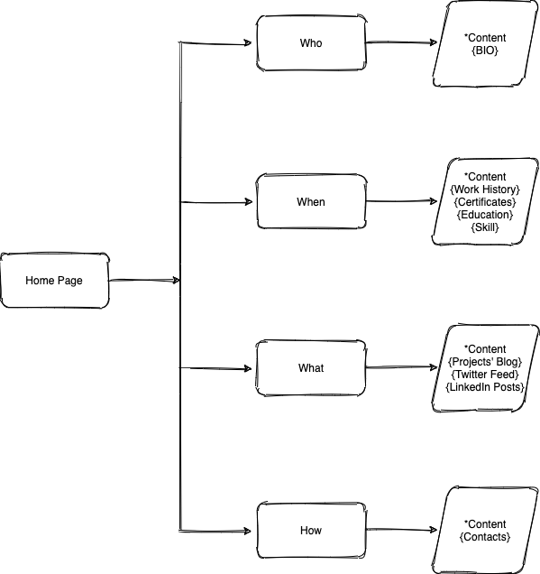

>>>>>>>>># ***Mobile Wireframes***
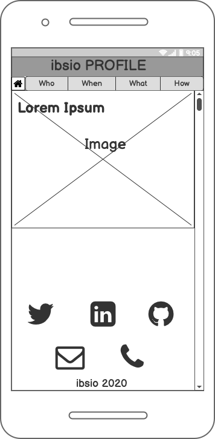
## **Home Page**

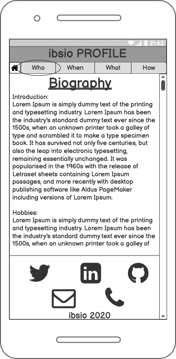
## **Bio Page**

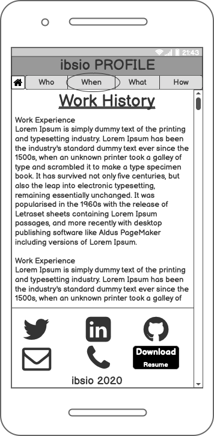
## **Work History Page**

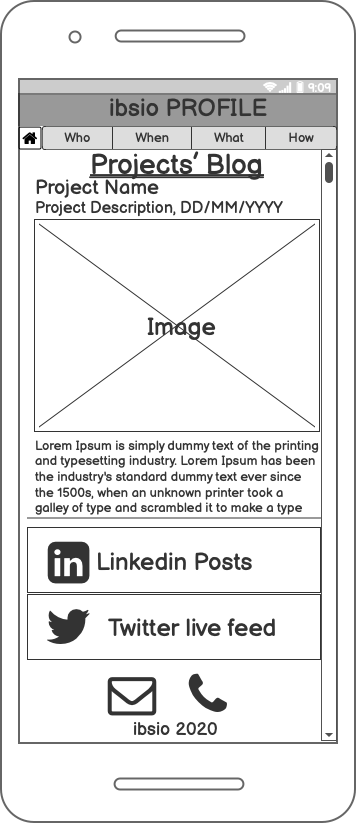
## **Blog/Projects Page**

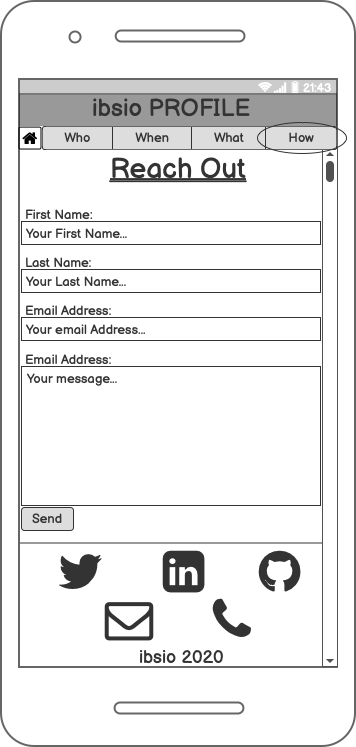
## **Contact Page**

>>>>>>>>># ***Tablet Wireframes***
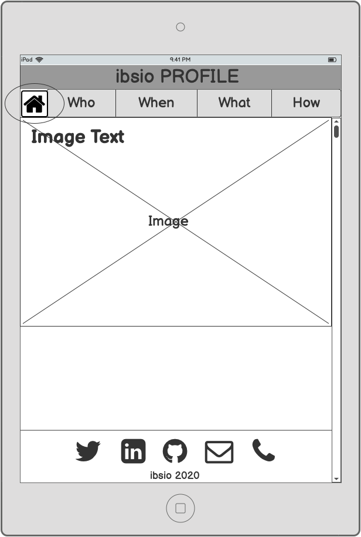
## **Home Page**

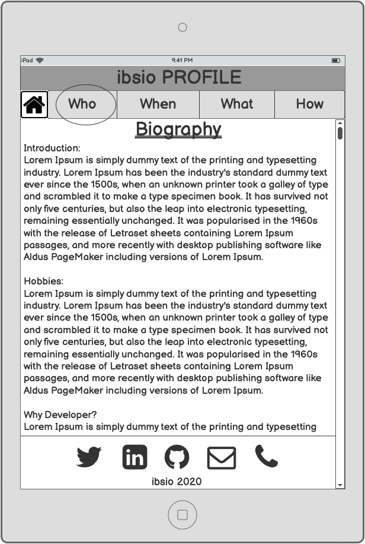
## **Bio Page**

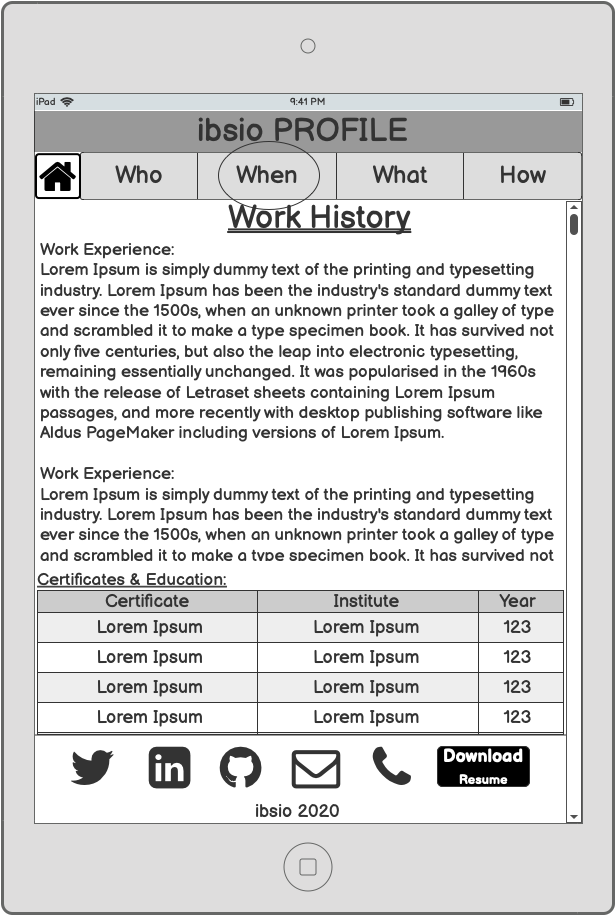
## **Work History Page**

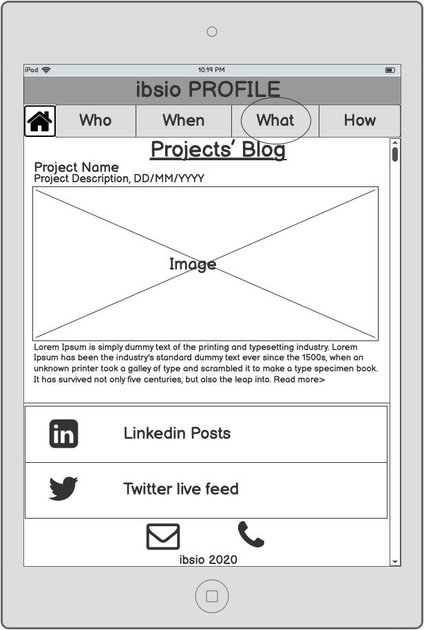
## **Blog/Projects Page**

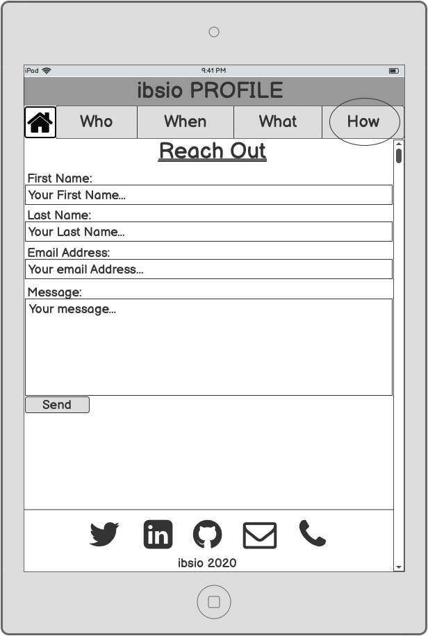
## **Contact Page**

>>>>>>>>># ***DeskTop Wireframes***
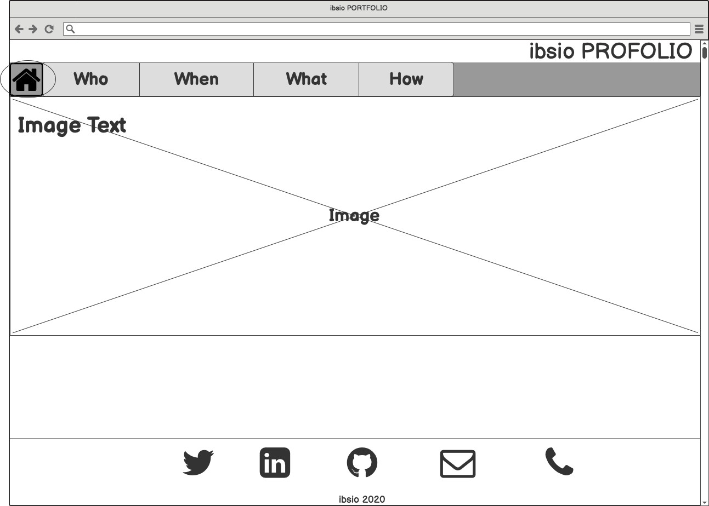
## **Home Page**

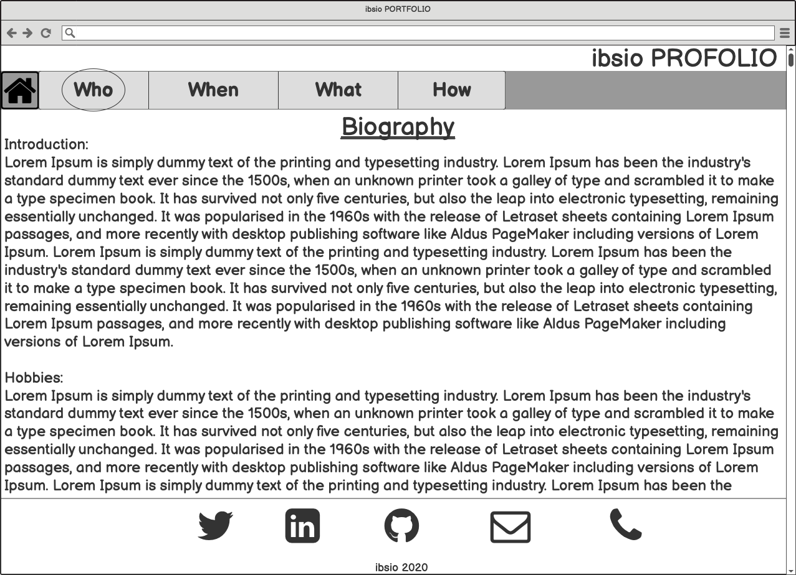
## **Bio Page**

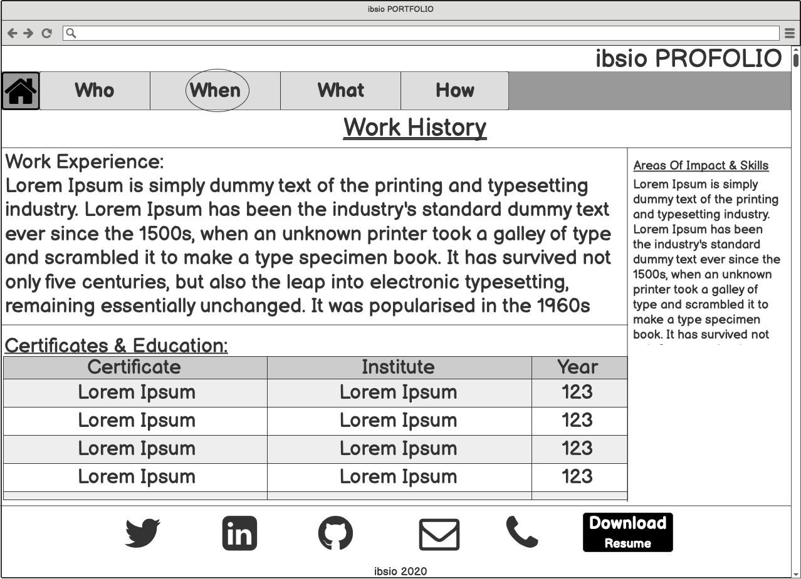
## **Work History Page**

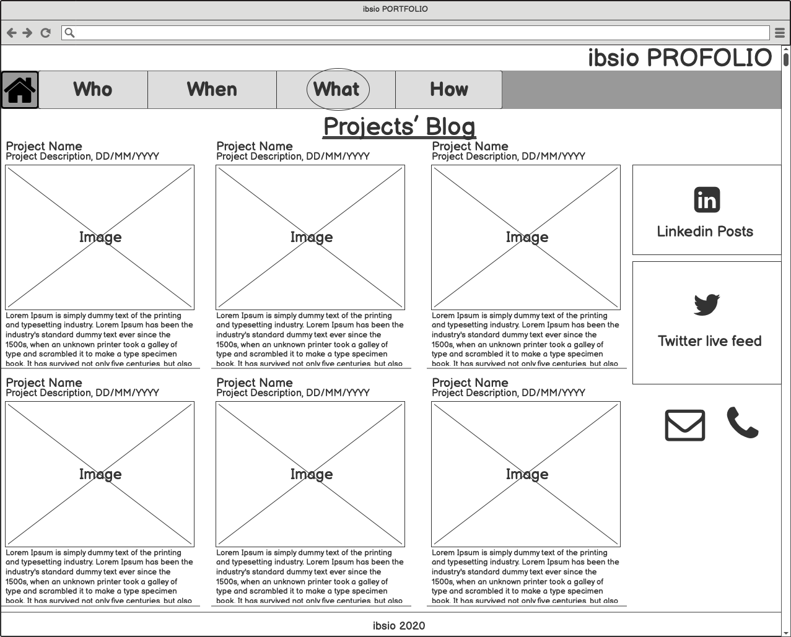
## **Blog/Projects Page**

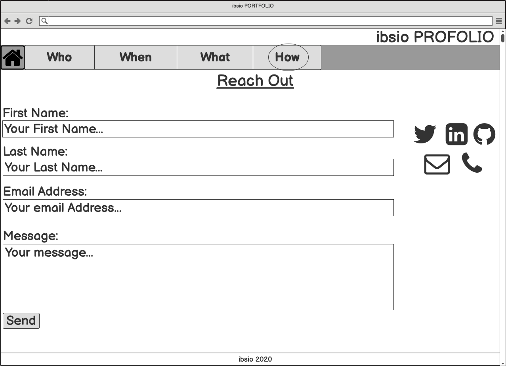
## **Contact Page**

**Project board is available on *[Trello](https://trello.com/invite/b/ifvqbriS/30afaf24b8772a1a3447a957ba96cc7f/ibsio-portfolio)***.